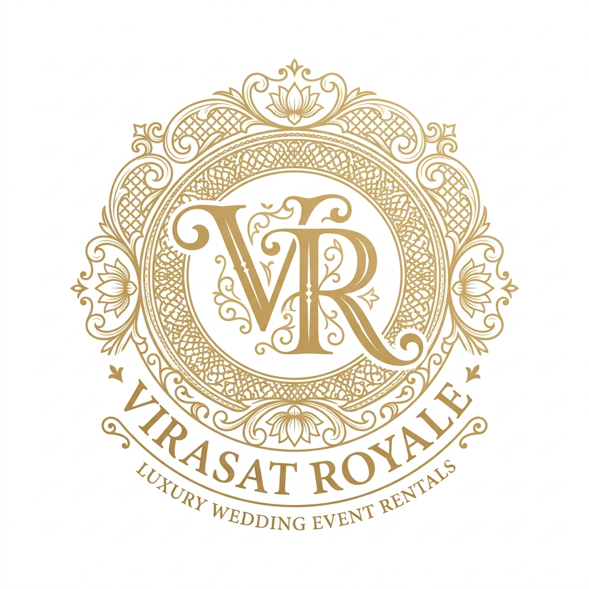
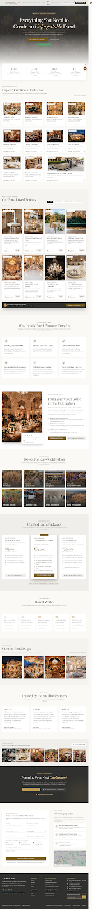



# Virasat Royale — Luxury Wedding & Event Rentals

> **Haute Event Rentals** — Curating bespoke furniture, majestic mandaps, architectural lighting, and premier event infrastructure for India's finest weddings and celebrations.

[](LICENSE)
[]()
[]()

---

## 📋 Table of Contents

- [About](#about)
- [Features](#features)
- [Tech Stack](#tech-stack)
- [Project Structure](#project-structure)
- [Getting Started](#getting-started)
- [Sections Overview](#sections-overview)
- [Design System](#design-system)
- [Contact](#contact)

---

## About

**Virasat Royale** is a premium luxury event rental website for Pan-India haute event rentals. The platform showcases curated heirloom-grade inventory — handcrafted mandaps, bespoke brassware, royal seating, crystal chandeliers, antique textiles, and luxury tableware — for royal weddings, destination celebrations, and corporate galas.

The design philosophy blends **royal Indian heritage architecture** (jali motifs, arched symmetry, polished marble) with the restrained layout of **haute couture lookbooks and museum monographs**.

---

## ✨ Features

- 🏛️ **Immersive Hero Section** — Full-bleed palace backdrop with parallax scaling
- 📊 **Trust Statistics Strip** — 1,200+ curated events, 180+ rental styles, 15+ palace partners
- 🛋️ **Rental Catalog** — 11 specialized categories with detailed product cards
- 💎 **Featured Items Carousel** — Curated inventory with IDs, specifications, and pricing
- 📦 **Tiered Package System** — 3 wedding packages from ₹85,000 to ₹5,50,000
- 🌙 **Dark / Light Mode** — One-click theme toggle with full dark mode support
- 📋 **Quote Enquiry Form** — Event date pickers, venue, budget tiers, WhatsApp trigger
- ❓ **FAQ Accordion** — Rental policies, logistics, and security deposit Q&A
- 📱 **Fully Responsive** — Mobile, tablet, and desktop optimized layouts
- ⚡ **Floating Controls** — Sticky WhatsApp concierge + Back-to-top button
- 🔍 **SEO Optimized** — Semantic HTML, meta tags, and descriptive alt attributes

---

## 🛠️ Tech Stack

| Technology | Purpose |
|---|---|
| **HTML5** | Semantic page structure |
| **Tailwind CSS (CDN)** | Utility-first styling with custom design tokens |
| **Google Fonts** | Playfair Display + Plus Jakarta Sans |
| **Google Material Symbols** | Iconography throughout the UI |
| **Vanilla JavaScript** | Dark mode toggle, scroll animations, FAQ accordion |

---

## 📁 Project Structure

```
demo/
├── index.html.html        # Main single-page application
├── logo.jpg               # Virasat Royale brand logo (local asset)
├── screen.png             # Project screenshot / preview
├── DESIGN.md              # Full design system specification
└── README.md              # This file
```

---

## 🚀 Getting Started

### Prerequisites
- [XAMPP](https://www.apachefriends.org/) with Apache module running

### Run Locally

1. **Start XAMPP** → Start the **Apache** module from the XAMPP Control Panel.

2. **Open in browser:**
   `
   http://localhost/demo/index.html.html
   `

3. No build step, no dependencies to install. The page loads directly.

---

## 📄 Sections Overview

| # | Section | Description |
|---|---------|-------------|
| 1 | **Top Bar** | Contact numbers, WhatsApp link, Pan-India badge, theme toggle |
| 2 | **Navigation** | Sticky header with Rentals & Packages mega menus, Quote Cart |
| 3 | **Hero** | Immersive palace backdrop with headline and CTAs |
| 4 | **Stats Strip** | Trust indicators and key business metrics |
| 5 | **Rental Categories** | 11 category tiles with icons |
| 6 | **Featured Rentals** | Curated product showcase with pricing |
| 7 | **Event Packages** | Three tiered packages with inclusions |
| 8 | **How It Works** | 5-step consultation-to-teardown process |
| 9 | **Occasions** | 8 event types served |
| 10 | **FAQ** | Accordion with rental policies and logistics |
| 11 | **Quote Enquiry** | Lead capture form with WhatsApp integration |
| 12 | **Footer** | Atelier addresses, quick links, newsletter signup |

---

## 🎨 Design System

The full design system is documented in [DESIGN.md](DESIGN.md).

### Color Palette

| Token | Hex | Usage |
|---|---|---|
| primary | #775a19 | CTAs, highlights, borders |
| primary-container | #c5a059 | Champagne gold accents |
| primary-fixed | #ffdea5 | Warm gold on dark surfaces |
| background | #fbf9f6 | Ivory silk canvas |
| on-surface | #1b1c1a | Body text |
| inverse-surface | #30312f | Dark footer / header bar |

### Typography

| Scale | Font | Size |
|---|---|---|
| display-hero | Playfair Display | 4.5rem |
| headline-lg | Playfair Display | 3rem |
| headline-md | Playfair Display | 2.25rem |
| body-lg | Plus Jakarta Sans | 1.125rem |
| body-md | Plus Jakarta Sans | 0.9375rem |
| label-caps | Plus Jakarta Sans | 0.6875rem (tracked) |

---

## 📞 Contact

| Channel | Details |
|---|---|
| Phone | +91 98200 45678 / 45679 |
| WhatsApp | wa.me/919820045679 |
| Email | concierge@virasatroyale.com |
| Delhi | The Grand Pavilion, MG Road, New Delhi |
| Mumbai | BKC Depot, Mumbai |
| Hours | Mon - Sun: 10 AM - 8 PM IST |

---

## 📸 Preview



---

© 2026 Virasat Royale Luxury Rentals Pvt. Ltd. · All Rights Reserved · GST Registered
